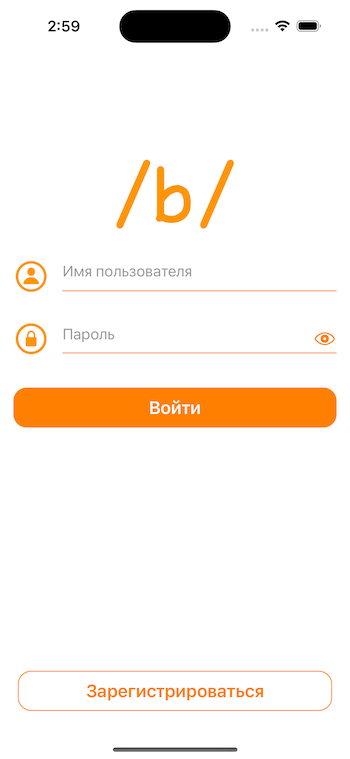
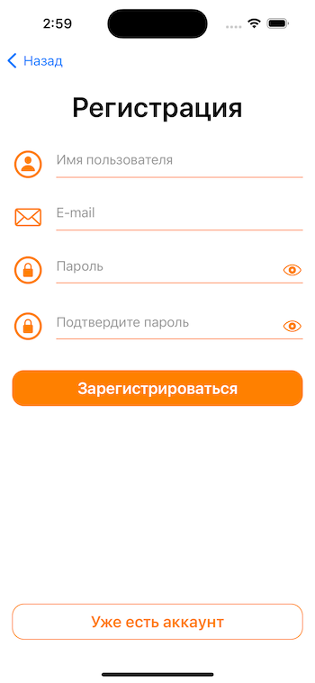
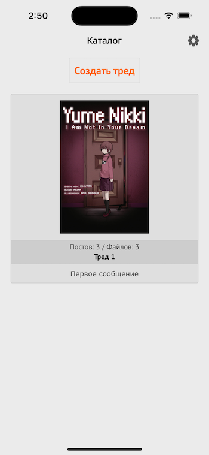
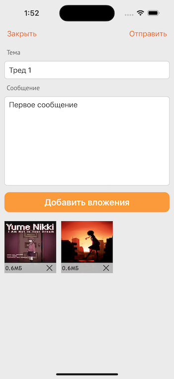
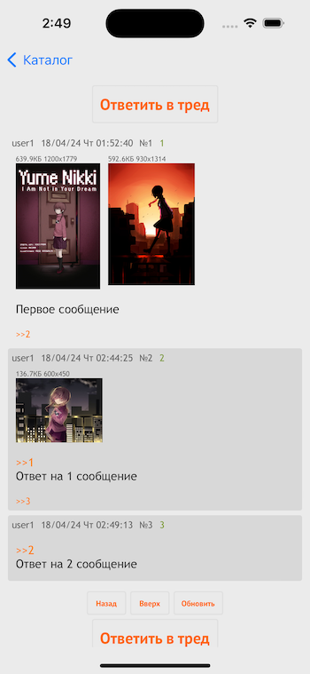

# BredApp
Приложение для общения, в котором можно создать тред на абсолютно любую тему, а люди, которые подхватят ваш поток мыслей, могут присоединиться к обсуждению.

## Особенности
* Clean Architecture.
* Dependency Injection.
* Иерархические контейнеры зависимостей.
* MVVM.
* Data Binding с помощью Combine.
* Flow Coordinator.
* Локализация.
* Пагинация.
* Загрузка файлов с помощью `multipart/form-data`.
* Keychain для хранения пользовательской сессии.

## Структура проекта
* `client`: содержит iOS приложение.
* `backend`: содержит серверное приложение, написанное с использованием [Vapor](https://vapor.codes).

## Запуск серверного приложения
Для того, чтобы запустить серверное приложение через Xcode, выполните следующие действия:
* Откройте файл `Package.swift`.
* Установите рабочую директорию (Working Directory) схемы в Xcode в корневую директорию проекта.
* Запустите проект.

## Экраны
### SignIn/SignUp
 

### ThreadList

### CreateThread

### Thread
